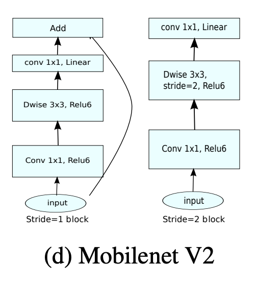
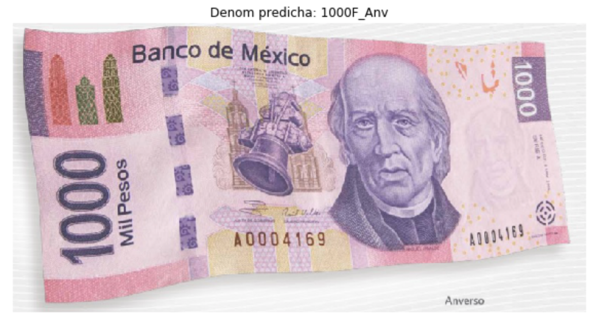
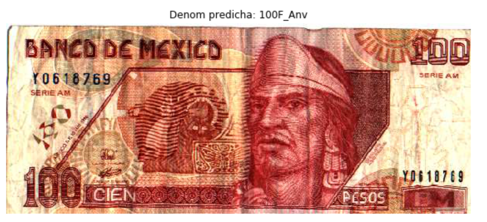
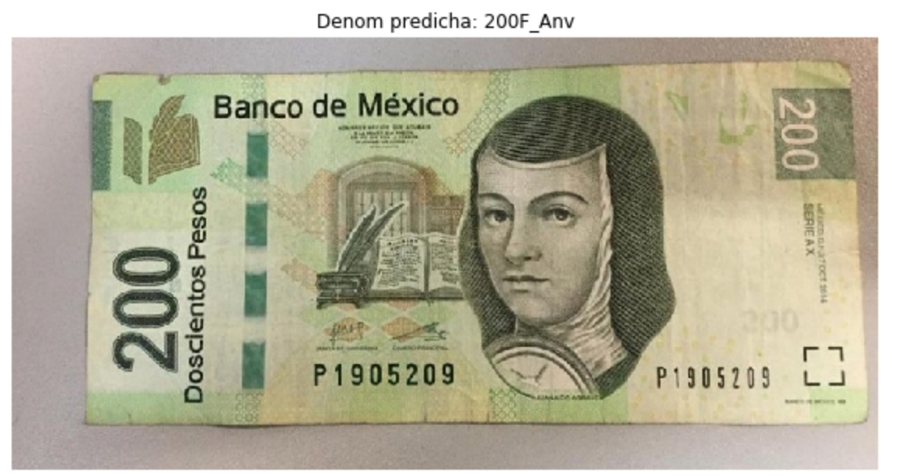
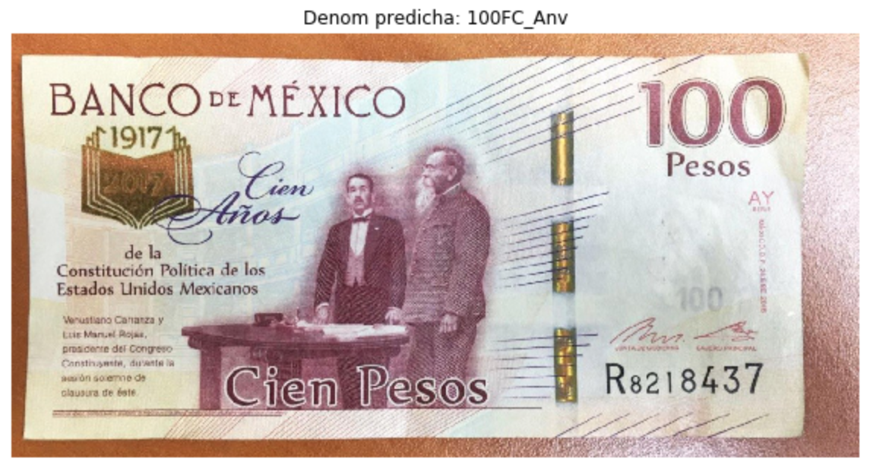
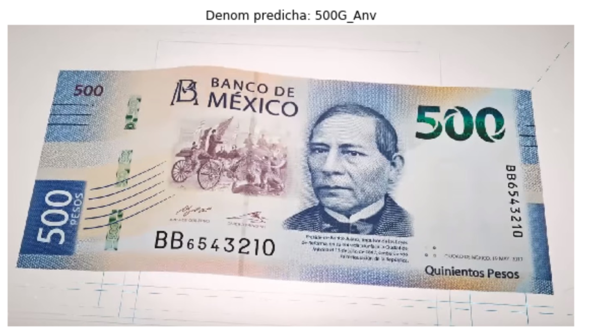
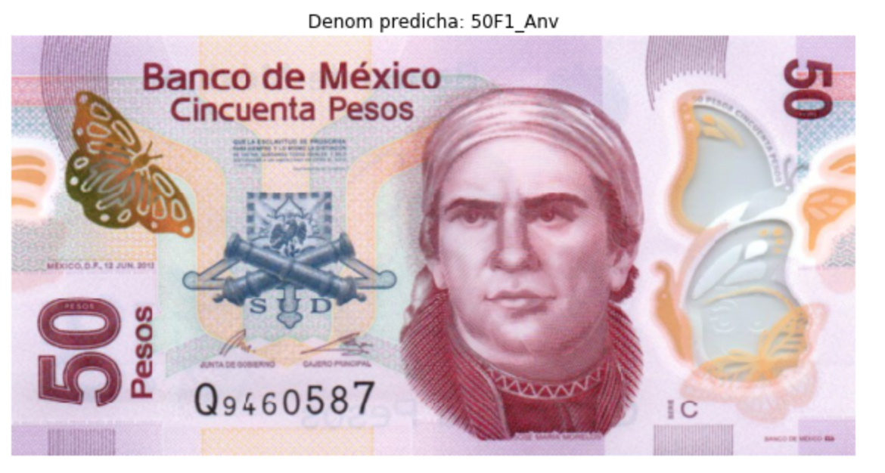
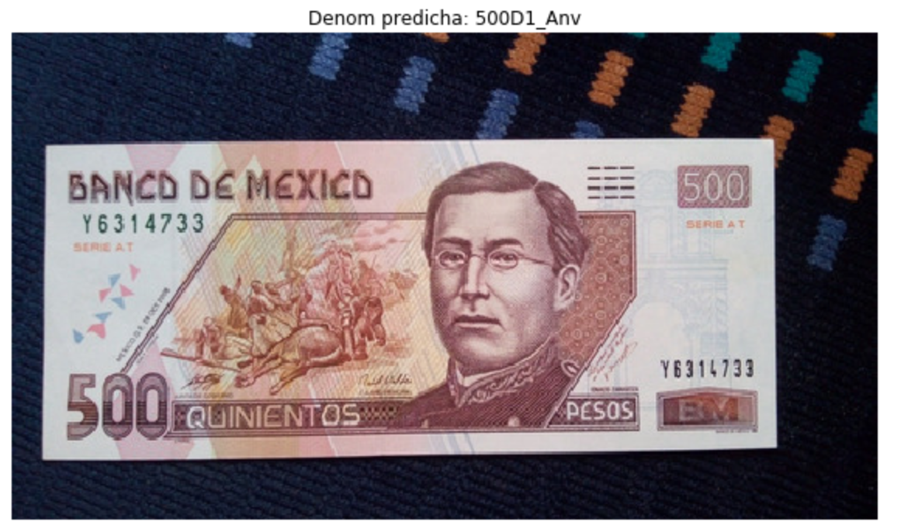
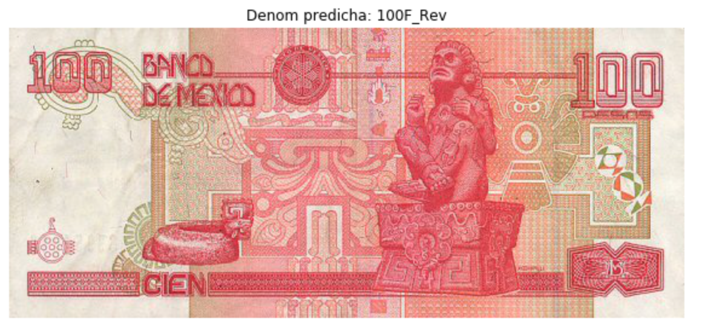
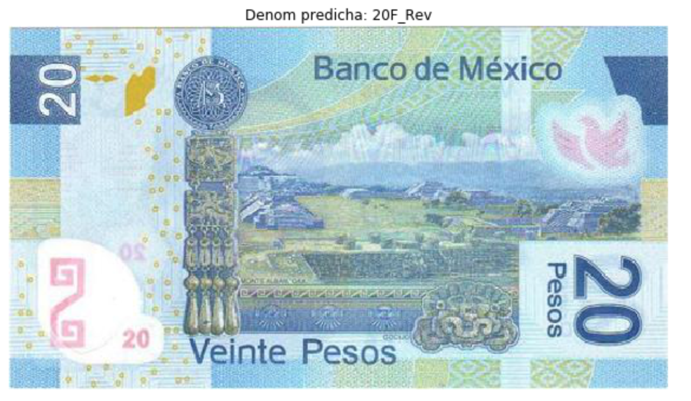

# Recognize Mexican Banknotes using Transfer Learning
Se utilizó una arquitectura de red MobileNet V2, entrenada con la base de datos Imagenet, para la aplicación de transferencia de aprendizaje en el desarrollo de un clasificador de billetes mexicanos.

**Autor:**  M. en C. Mario Xavier Canche Uc, Mayo 2020, *mario.canche@cimat.mx*  
**Basado en:** 
- https://colab.research.google.com/github/tensorflow/examples/blob/master/community/en/flowers_tf_lite.ipynb
- https://github.com/tensorflow/examples/blob/master/community/en/flowers_tf_lite.ipynb

**Material de referencia:**
- https://towardsdatascience.com/deep-learning-using-transfer-learning-python-code-for-resnet50-8acdfb3a2d38
- https://medium.com/metadatos/qué-es-la-transferencia-de-aprendizaje-y-cómo-aplicarla-a-tu-red-neuronal-e0e120156e40

## ¿Cómo funciona?
La estrategia consiste en usar redes neuronales profundas previamente preentrenadas con bases de datos grandes (Imagenet) y adaptarlas al problema de nuestro interés. Reutilizando los pesos y parametrós del problema de clasificación inicial otorgamos a nuestra red la capacidad de reconocer bastantes cosas desde el comienzo, lo reduce el tiempo de entrenamiento y los requerimientos de poder computacional. Esto puede ser visto como la transferencia de conocimientos adquiridos de un modelo general a nuestro problema más particular.  
Se puede utilizar cualquier modelo preentrenado como base para la transferencia de aprendizaje, en nuestro caso utilizaremos la red MobileNet V2 para poder exportarla a dispositivos móviles.

## Arquitectura del MobileNet V2

## Resultados
Se entreno el modelo para las siguientes denominaciones: {0:'1000F_Anv', 
           1:'100FC_Anv', 
           2:'100FC_Rev', 
           3:'100F_Anv', 
           4:'100F_Rev', 
           5:'200FConm_Anv', 
           6:'200FConm_Rev', 
           7:'200F_Anv', 
           8:'200F_Rev', 
           9:'20F_Anv', 
           10:'20F_Rev', 
           11:'500D1_Anv', 
           12:'500D1_Rev', 
           13:'500F_Anv', 
           14:'500F_Rev', 
           15:'500G_Anv', 
           16:'50F1_Anv', 
           17:'50F1_Rev',
           18:'50F_Anv',
           19:'50F_Rev'}; y se obtuvierón los siguientes resultados:

